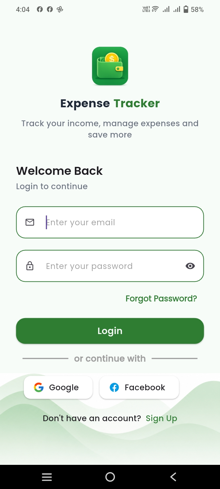
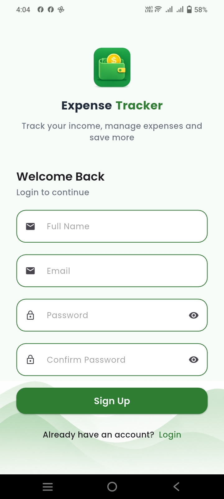
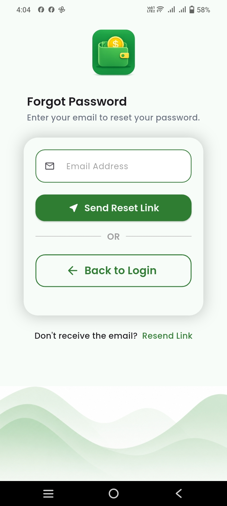
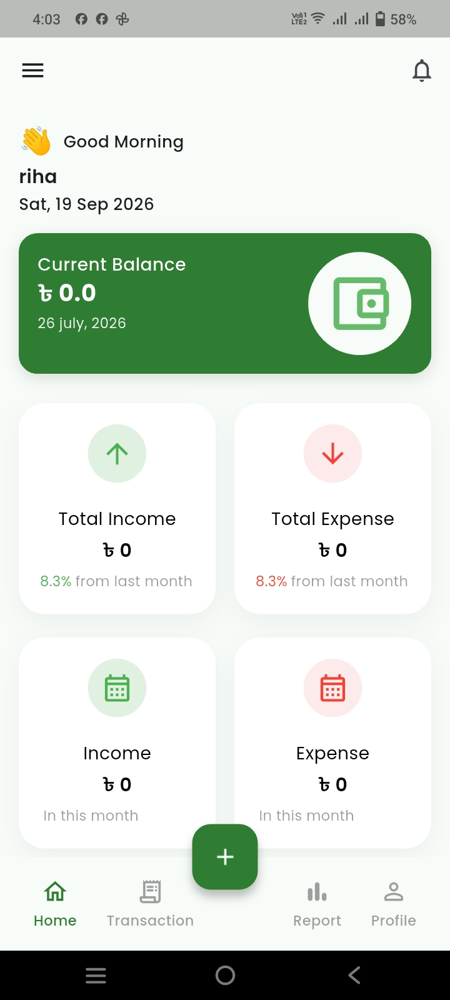

# Monira Apps

Flutter UI kits, mobile app source code, and reusable Flutter components for developers.

## What I Create

I create professionally designed Flutter UI source code and reusable mobile app interfaces.

### Products & Projects

* Authentication UI
* Expense Tracker UI
* E-commerce UI
* Dashboard UI
* Reusable Flutter Components
* Mobile App Source Code

## Technology

* Flutter
* Dart
* Provider
* REST API
* Firebase

## About

Monira Apps provides ready-to-use Flutter UI source code and mobile app components designed to help developers build applications faster.

## Contact

For product and business inquiries, please contact Monira Apps through the available contact channels.

## Expense Tracker UI

A clean and reusable Flutter Expense Tracker UI designed for mobile applications.

### Screenshots

#### Login

#### Sign Up

#### Forgot Password

#### Home

#### Transaction

